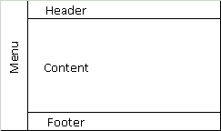

# Desafios HTML
Desafios em HTML feitos durante a [Formação HTML Developer](https://dio.me/curso-html/AFD1W2MD3BXI) pela plataforma [DIO](https://web.dio.me/home)

# 1. Página Completa
## Entendo o Desafio
Este desafio tem como objetivo, criar um site "quase" completo, com tudo o que vimos neste módulo. Os temas que deverão ser abordados são:
* Formulários
* Estruturação e formatação de texto
* Mídias
* Tabelas
Além de outros recursos falados nas aulas!

## Instruções
1. Você deve criar um site de uma clínica médica (você escolhe a especialidade)
2. Este site deve conter o seguinte menu de navegação:
    * Página Principal
    * Sobre a clínica
    * Horário de Atendimento
    * Contato
3. Deve, obrigatoriamente, utilizar todas os assuntos abordados nas aulas.

## Estrutura das Páginas
Todas as páginas terão que seguir um padrão pré-definido. Como não aprendemos sobre CSS ainda, utilize o arquivo template.html para utilizar como base. Ele segue uma estrutura semelhante a image abaixo.

No **Menu**, ficará localizado o menu de navegação (ah vá!), no **Header** de cada página ficará uma imagem, no **Footer** informações de contato, e o **Content** é o conteúdo de cada página.

### Página Principal
1. Deve ter uma imagem no **Header**.
2. Em **Content** uma breve descrição sobre a clínica.
3. **Menu** e **Footer** padrões em todas as páginas.

### Sobre a clínica
1. Deve ter uma imagem diferente no **Header**.
2. Em **Content** um texto falando sobre a clínica.
3. **Menu** e **Footer** padrões em todas as páginas.

### Horário de Atendimento
1. Deve ter uma imagem diferente no **Header**.
2. Em **Content** um pequeno texto falando sobre os serviços, e uma tabela 3. de preços, onde cada linha é um serviço, com o preço de cada um de acordo com os dias da semana.
**Menu** e **Footer** padrões em todas as páginas.

| Serviços | Segunda a Sexta | Sábados | Feriados   |
|----------|-----------------|---------|------------|
| Clínica geral	| 08h - 19h	| 08h - 14h	| 08h - 14h |
| Psicologia	| 08h - 19h	| 08h - 14h	| 08h - 14h |
| Pediatria	    | 08h - 19h	| 08h - 18h	| -         |
| Oftalmologia	| 08h - 19h	| 08h - 18h	| -         |

### Contato
1. Deve ter uma imagem diferente no Header.
2. Em Content deve ter:
    * Os telefones de contato (celular e whatsapp)
    * Endereço completo da clínica
    * Um Iframe com o Google Maps apontando o endereço da clínica
    * Um formulário de contato com:
        * Nome (type="text")
        * E-mail (type="email")
        * Assunto (type="text")
        * Mensagem (textarea)
        * Botões de envias e limpar formulário
3. **Menu** e **Footer** padrões em todas as páginas.
Desafio está lançado! Com tudo que aprendemos neste Módulo é perfeitamente possível criar este site!   

## GitHub
O código-fonte base preparado para este Desafio de Projeto está versionado no GitHub, no seguinte endereço:
https://github.com/digitalinnovationone/trilha-html-modulo-2        

# 2. Wikipedia

## Objetivo
Este desafio consiste em treinar você com relação a estrutura do site, e também aplicar conhecimentos adiquiridos sobre semântica e acessibilidade.    

## GitHub
Todo código-fonte desenvolvido durante o curso foi versionado no GitHub, no seguinte endereço:

https://github.com/digitalinnovationone/trilha-html-modulo-3
